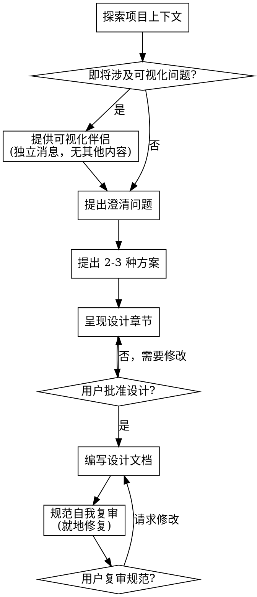

# 将想法头脑风暴为设计

通过自然的协作对话，帮助将想法转化为完整的设计和规范。

首先了解当前的项目上下文，然后一次问一个问题以打磨想法。一旦你理解要构建什么，呈现设计并获得用户批准。

<HARD-GATE>
在呈现设计并获得用户批准之前，不要调用任何实现技能、编写任何代码、搭建任何项目或采取任何实现行动。这适用于每个项目，无论感知上的简单性如何。
</HARD-GATE>

## 反模式："这太简单了不需要设计"

每个项目都应经过此流程。待办列表、单功能工具、配置变更 —— 都是如此。"简单"的项目正是未审视的假设造成最多浪费工作的地方。设计可以很短（真正简单的项目几句话），但你必须呈现它并获得批准。

## 清单

你必须为以下每项创建任务并按顺序完成：

1. **探索项目上下文** —— 与用户确认本会话要读取的文件范围；如果用户说全部，则读取所有文件；否则，只读取指定文件；近期提交始终要读取；
2. **提供可视化伴侣**（如果主题将涉及可视化问题） —— 这是独立的消息，不能与澄清问题合并。参见下方"可视化伴侣"部分。
3. **提出澄清问题** —— 一次一个，理解目的/约束/成功标准
4. **提出 2-3 种方案** —— 包含权衡及你的建议
5. **呈现设计** —— 按其复杂性分节呈现，每节后获得用户批准
6. **编写设计文档** —— 保存到 `docs/recipe/YYYYMMDD_<topic>.md`
7. **规范自我复审** —— 对占位符、矛盾、歧义、范围进行快速内联检查（见下文）
8. **用户复审书面规范** —— 在继续之前要求用户复审规范文件

## 流程图

## 流程

**理解想法：**

- 首先检查当前项目状态（文件、文档、近期提交，范围遵循第一项清单）
- 在提出详细问题之前，评估范围：如果请求描述了多个独立子系统（例如"构建一个包含聊天、文件存储、计费和分析的平台"），立即标记此问题。不要花时间打磨一个需要先拆分的项目的细节。
- 如果项目对一个规范来说太大，帮助用户拆分为子项目：哪些是独立部分，它们如何关联，应该按什么顺序构建？然后通过正常的设计流程对第一个子项目进行头脑风暴。每个子项目获得自己的规范 → 计划 → 实施循环。
- 对于范围适当的项目，一次问一个问题以打磨想法
- 尽可能选择多选题，但开放式问题也可以
- 每条消息只问一个问题 —— 如果一个主题需要更多探索，分解为多个问题
- 关注理解：目的、约束、成功标准

**探索方案：**

- 提出 2-3 种不同的方法及其权衡
- 对话式地呈现选项，并给出你的建议和理由
- 以你推荐的选项打头并解释原因

**呈现设计：**

- 一旦你认为理解了要构建什么，就呈现设计
- 按其复杂性缩放每个章节：直白的几句话；细致入微的最多 200-300 字
- 每节之后询问目前看起来是否正确
- 涵盖：架构、组件、数据流、错误处理、测试
- 准备回去澄清如果有什么讲不通

**为隔离和清晰而设计：**

- 将系统拆分为更小的单元，每个单元有明确的目的，通过明确定义的接口通信，可以独立理解和测试
- 对于每个单元，你应该能够回答：它做什么，如何使用，它依赖什么？
- 是否有人能在不阅读其内部的情况下理解一个单元做什么？是否能更改其内部而不破坏消费者？如果不能，边界需要改进。
- 更小的、良好边界的单元对你来说也更容易处理 —— 你最适合对能一次性在上下文中容纳的代码进行推理，并且当文件更专注时，你的编辑也更可靠。当文件变大时，这通常是一个信号，表明它做太多事情了。

**在已有代码库中工作：**

- 在提出变更之前探索当前结构。遵循既有模式。
- 在现有代码有影响工作的问题时（例如，变得太大的文件、不清晰的边界、纠缠的职责），将针对性的改进纳入设计中 —— 就像优秀开发者在他们正在处理的代码中做的那样。
- 不要提出不相关的重构。专注于服务于当前目标的事情。

## 设计之后

**文档：**

- 将经过验证的设计（recipe）写入 `docs/recipe/YYYYMMDD_<topic>_recipe.md`
- 如果可用，使用 elements-of-style:writing-clearly-and-concisely 技能

**规范自我复审：**
写完规范文档后，用全新的眼光看待它（使用"规范文档复审者提示模板"技能）：

1. **占位符扫描：** 是否有"TODO"、"TODO"、不完整的章节或模糊的需求？修复它们。
2. **内部一致性：** 各章节是否相互矛盾？架构是否与功能描述匹配？
3. **范围检查：** 是否足够集中于单个实施计划，还是需要拆分？
4. **歧义检查：** 任何需求是否可能被以两种不同方式解释？如果是，选择一种并明确化。

就地修复任何问题。无需重新复审 —— 修复并继续。

**用户复审关卡：**
在规范复审循环通过之后，要求用户在继续之前复审书面规范：

> "规范已写入 `<path>`。请复审它并让我知道你是否想做任何修改。"

等待用户的响应。如果他们要求修改，进行修改并重新运行规范复审循环。仅当用户批准后才继续。

## 关键原则

- **一次一个问题** —— 不要用多个问题让用户应接不暇
- **优先多选题** —— 比开放式更容易回答
- **无情地 YAGNI** —— 从所有设计中删除不必要的功能
- **探索替代方案** —— 在确定之前始终提出 2-3 种方法
- **增量验证** —— 呈现设计，在前进之前获得批准
- **保持灵活** —— 当某些事情讲不通时回去澄清

## 可视化伴侣

基于浏览器的伴侣，用于在头脑风暴期间显示模型图、图表和可视化选项。作为工具提供 —— 而非模式。接受伴侣意味着它可用于受益于可视化处理的问题；这并不意味着每个问题都通过浏览器。

**提供伴侣：** 当你预期即将到来的问题将涉及可视化内容（模型图、布局、图表）时，一次性提供以获得同意：

> "我们正在做的一些事情如果我可以在网页浏览器中向你展示，可能会更容易解释。我可以随着我们的进展制作模型图、图表、比较和其他可视化内容。此功能仍较新且可能占用较多 token。要试试吗？（需要打开本地 URL）"

**此提议必须作为独立消息。** 不要将其与澄清问题、上下文摘要或任何其他内容合并。消息应仅包含上述提议且不包含其他内容。在继续之前等待用户的响应。如果他们拒绝，继续纯文本头脑风暴。

**逐问题决策：** 即使在用户接受之后，也要为每个问题决定是使用浏览器还是终端。测试是：**用户是否通过看到比通过阅读更能理解这一点？**

- **使用浏览器**用于本身就是可视化的内容 —— 模型图、线框图、布局、组件设计
- **使用终端**用于文本或表格内容 —— 需求问题、概念性选择、权衡列表、A/B/C/D 文本选项、范围决策

关于 UI 主题的问题不会自动成为可视化问题。"此上下文中个性是什么意思？"是一个概念性问题 —— 使用终端。"哪种向导布局感觉更好？"是一个可视化问题 —— 使用浏览器。

如果他们同意伴侣，请在继续之前阅读详细指南：
`skills/recipe/visual-companion.md`
