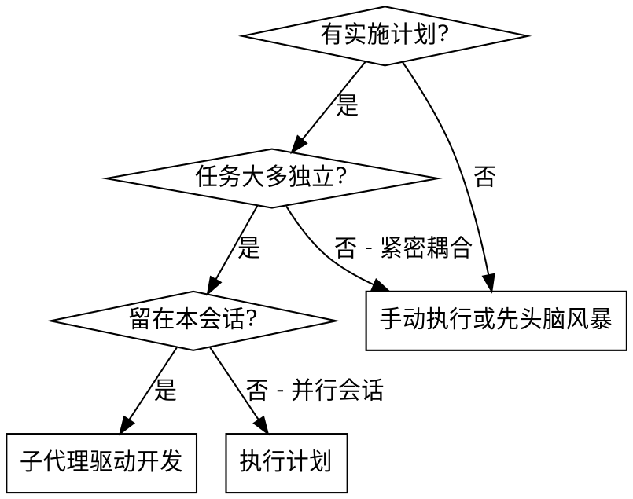
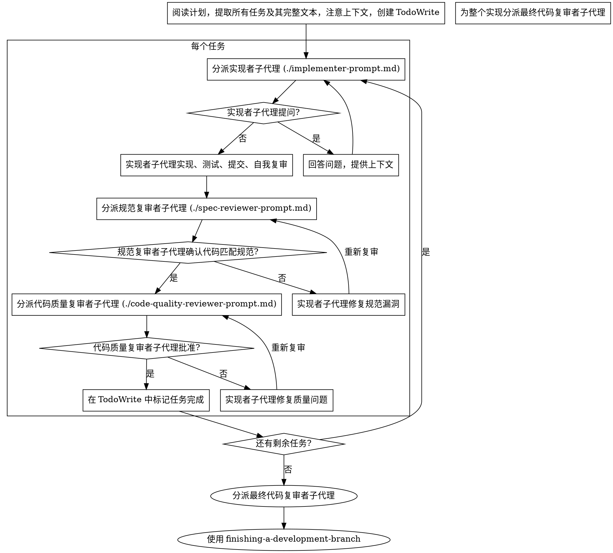

# 子代理驱动开发

通过为每个任务分派全新的子代理来执行计划，并在每个任务后进行两阶段复审：首先是规范合规性复审，然后是代码质量复审。

**为什么使用子代理：** 你将任务委托给具有隔离上下文的专门代理。通过精确地制作它们的指令和上下文，你确保它们保持专注并成功完成其任务。它们永远不应继承你会话的上下文或历史 —— 你精确地构建它们需要的内容。这也为你自己的协调工作保留了上下文。

**核心原则：** 每个任务全新的子代理 + 两阶段复审（规范然后质量）= 高质量、快速迭代

## 何时使用



**vs. 执行计划（并行会话）：**
- 同一会话（无上下文切换）
- 每个任务全新的子代理（无上下文污染）
- 每个任务后两阶段复审：先是规范合规性，然后是代码质量
- 更快迭代（任务之间无需人在循环中）

## 流程



## 处理实现者状态

实现者子代理报告四种状态之一。适当处理每种：

**DONE：** 进入规范合规性复审。

**DONE_WITH_CONCERNS：** 实现者完成了工作但标记了疑虑。在进入复审之前阅读顾虑。如果顾虑关乎正确性或范围，在复审之前解决。如果它们是观察（例如"此文件正在变大"），记下并进入复审。

**NEEDS_CONTEXT：** 实现者需要未提供的信息。提供缺失的上下文并重新分派。

**BLOCKED：** 实现者无法完成任务。评估阻碍：
1. 如果是上下文问题，提供更多上下文并用相同模型重新分派
2. 如果任务需要更多推理，用更有能力的模型重新分派
3. 如果任务太大，拆分为更小的部分
4. 如果计划本身有误，升级到人类

**永远不要**忽略升级或在没有更改的情况下强迫相同模型重试。如果实现者说它卡住了，那就需要改变一些东西。

## 提示模板

- `./implementer-prompt.md` —— 分派实现者子代理
- `./spec-reviewer-prompt.md` —— 分派规范合规性复审者子代理
- `./code-quality-reviewer-prompt.md` —— 分派代码质量复审者子代理

## 示例工作流

```
你：我正在使用子代理驱动开发来执行此计划。

[一次性阅读计划文件：docs/superpowers/plans/feature-plan.md]
[提取所有 5 个任务及其完整文本和上下文]
[使用所有任务创建 TodoWrite]

Task 1：Hook 安装脚本

[获取 Task 1 文本和上下文（已提取）]
[使用完整任务文本 + 上下文分派实现子代理]

实现者："在我开始之前 —— hook 应该在用户级还是系统级安装？"

你："用户级（~/.config/superpowers/hooks/）"

实现者："明白了。正在实现..."
[稍后] 实现者：
  - 实现了 install-hook 命令
  - 添加了测试，5/5 通过
  - 自我复审：发现我遗漏了 --force 标志，已添加
  - 已提交

[分派规范合规性复审者]
规范复审者：✅ 规范合规 —— 所有需求已满足，无额外内容

[获取 git SHA，分派代码质量复审者]
代码复审者：优点：良好的测试覆盖，干净。问题：无。已批准。

[标记 Task 1 完成]

Task 2：恢复模式

[获取 Task 2 文本和上下文（已提取）]
[使用完整任务文本 + 上下文分派实现子代理]

实现者：[无提问，继续]
实现者：
  - 添加了 verify/repair 模式
  - 8/8 测试通过
  - 自我复审：一切良好
  - 已提交

[分派规范合规性复审者]
规范复审者：❌ 问题：
  - 缺失：进度报告（规范说"每 100 项报告一次"）
  - 额外：添加了 --json 标志（未请求）

[实现者修复问题]
实现者：删除了 --json 标志，添加了进度报告

[规范复审者再次复审]
规范复审者：✅ 现在规范合规

[分派代码质量复审者]
代码复审者：优点：扎实。问题（重要）：魔法数字（100）

[实现者修复]
实现者：提取了 PROGRESS_INTERVAL 常量

[代码复审者再次复审]
代码复审者：✅ 已批准

[标记 Task 2 完成]

...

[所有任务后]
[分派最终代码复审者]
最终复审者：所有需求已满足，准备合并

完成！
```

## 优势

**vs. 手动执行：**
- 子代理自然遵循 TDD
- 每个任务全新的上下文（无混淆）
- 并行安全（子代理不互相干扰）
- 子代理可以提问（工作前与工作中）

**vs. 执行计划：**
- 同一会话（无交接）
- 持续进展（无等待）
- 复审检查点自动

**效率提升：**
- 无文件读取开销（控制器提供完整文本）
- 控制器精确策划所需的上下文
- 子代理一次性获得完整信息
- 问题在工作开始前浮现（而非之后）

**质量门：**
- 自我复审在交接前捕获问题
- 两阶段复审：规范合规性，然后代码质量
- 复审循环确保修复确实有效
- 规范合规性防止过度/不足构建
- 代码质量确保实现构建良好

**成本：**
- 更多子代理调用（每个任务实现者 + 2 个复审者）
- 控制器做更多准备工作（提前提取所有任务）
- 复审循环增加迭代
- 但早期捕获问题（比之后调试更便宜）

## 红旗

**永远不要：**
- **如果用户没有明确声明使用 Git 管理当前任务，则在任务完全完成之前不要执行任何 Git 操作**
- 跳过复审（规范合规性或代码质量）
- 在未修复问题的情况下继续
- 并行分派多个实现子代理（冲突）
- 让子代理读取计划文件（改为提供完整文本）
- 跳过场景设置上下文（子代理需要理解任务的位置）
- 忽略子代理问题（在让它们继续之前回答）
- 在规范合规性上接受"差不多"（规范复审者发现问题 = 未完成）
- 跳过复审循环（复审者发现问题 = 实现者修复 = 再次复审）
- 让实现者自我复审取代实际复审（两者都需要）
- **在规范合规性是 ✅ 之前开始代码质量复审**（顺序错误）
- 在任一复审有未解决问题时移到下一个任务

**如果子代理提问：**
- 清晰完整地回答
- 如需要提供额外上下文
- 不要催促它们进入实现

**如果复审者发现问题：**
- 实现者（同一子代理）修复它们
- 复审者再次复审
- 重复直到批准
- 不要跳过重新复审

**如果子代理任务失败：**
- 使用具体指令分派修复子代理
- 不要尝试手动修复（上下文污染）

## 集成

**必需的工作流技能：**

- **writing-plans** —— 创建此技能执行的计划
- **requesting-code-review** —— 复审者子代理的代码复审模板

**替代工作流：**

- **executing-plans** —— 用于并行会话而非同会话执行
